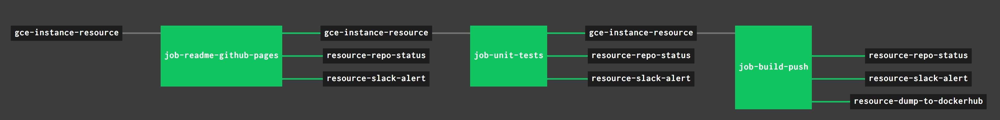

## TESTED, BUILT & PUSHED TO DOCKERHUB USING CONCOURSE

To automate the creation of the `gce-instance-resource` docker image, a
concourse pipeline will,

* Update README.md for gce-instance-resource github webpage.
* Unit Test the code.
* Build the docker image `gce-instance-resource` and push to DockerHub.

As seen in the pipeline diagram, the _resource-dump-to-dockerhub_ uses
the resource type
[docker-image](https://github.com/concourse/docker-image-resource)
to push a docker image to dockerhub.

`gce-instance-resource` also contains a few extra concourse resources:

* A resource (_resource-slack-alert_) uses a [docker image](https://hub.docker.com/r/cfcommunity/slack-notification-resource)
  that will notify slack on your progress.
* A resource (_resource-repo-status_) use a [docker image](https://hub.docker.com/r/dpb587/github-status-resource)
  that will update your git status for that particular commit.
* A resource ([_`resource-template`_](https://github.com/JeffDeCola/resource-template))
  that can be used as a starting point and template for creating other concourse
  ci resources.

For more information on using concourse for continuous integration,
refer to my cheat sheet on [concourse](https://github.com/JeffDeCola/my-cheat-sheets/tree/master/software/operations-tools/continuous-integration-continuous-deployment/concourse-cheat-sheet).
